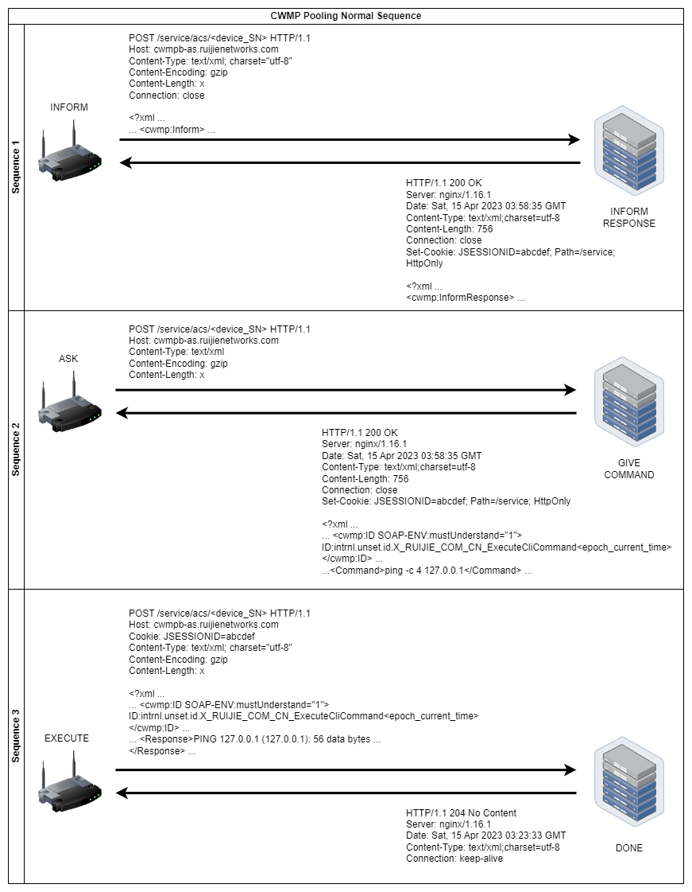
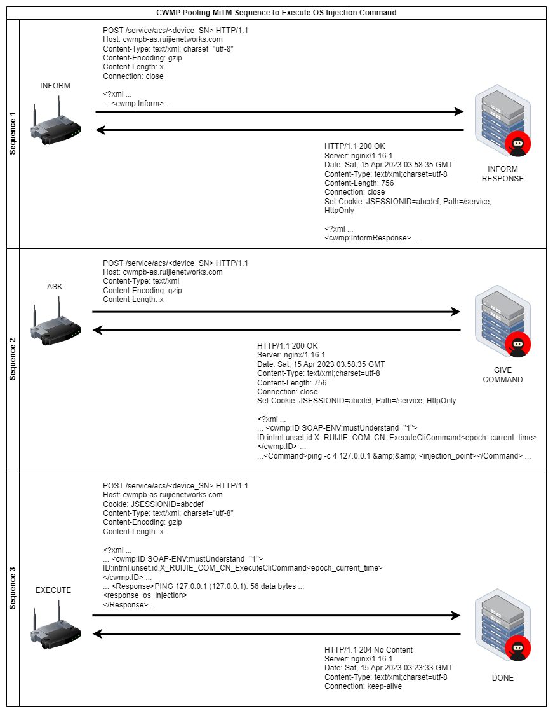
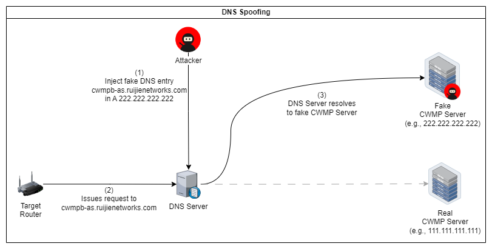
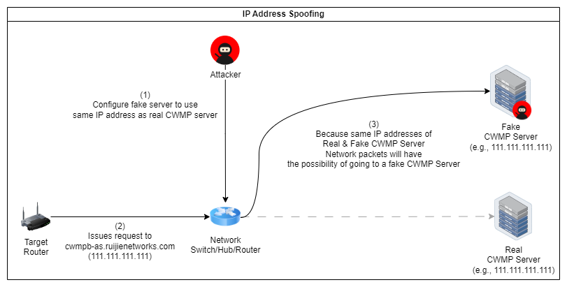
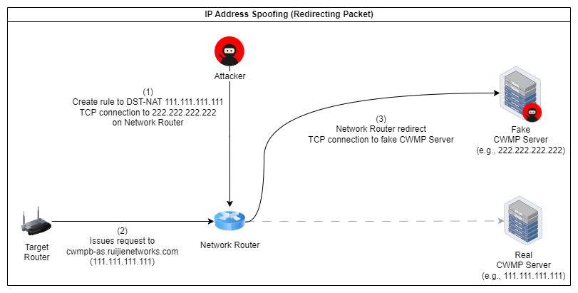
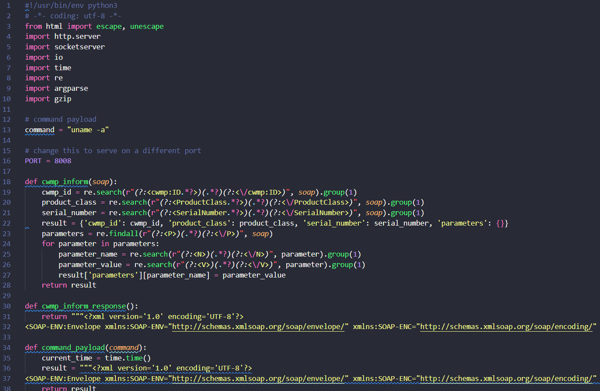
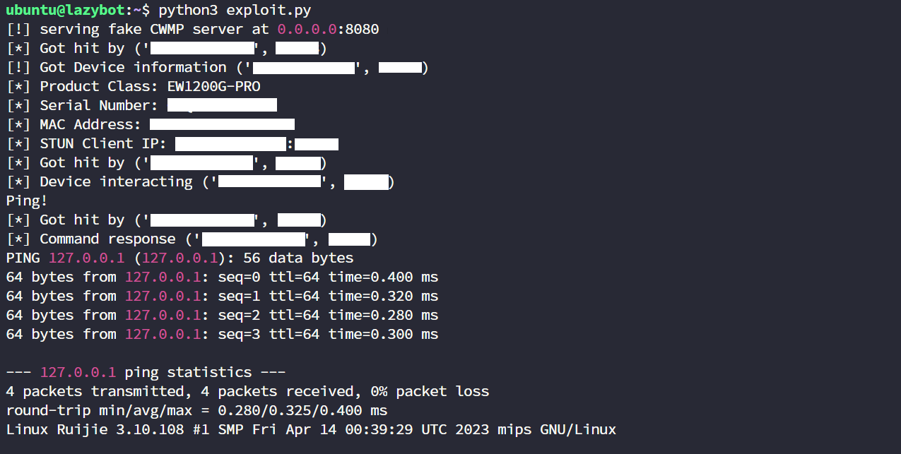

# Ruijie Reyee Wireless Router firmware version EW_3.0(1)B11P204 - MITM Remote Code Execution (RCE)

## Issue Description
The Ruijie Reyee Cloud Web Controller allows the user to use a diagnostic tool which includes a ping check to ensure connection to the intended network, but the ip address input form is not validated properly and allows the user to perform OS command injection.

In other side, Ruijie Reyee Cloud based Device will make pooling request to Ruijie Reyee CWMP server to ask if there's any command from web controller need to be executed. After analyze the network capture that come from the device, the connection for pooling request to Ruijie Reyee CWMP server is unencrypted HTTP request.

Because of unencrypted HTTP request that come from Ruijie Reyee Cloud based Device, attacker could make fake server using Man-in-The-Middle (MiTM) attack and send arbitrary commands to execute on the cloud based device that make CWMP request to fake server.

Once the attacker have gained access, they can execute arbitrary commands on the system or application, potentially compromising sensitive data, installing malware, or taking control of the system.

### Original CWMP Sequence

### MiTM CWMP Sequence

### MiTM Flow Topology

## Steps to reproduce/PoC
This step to reproduce/PoC using home router (EW1200G-PRO) as target, and python script to serve fake CWMP response that send command injection payload while the target device is communicating to CWMP server.

### Tested on
- EW1200G-PRO firmware version EW_3.0(1)B11P204 (Ruijie Reyee Wireless Router Cloud based Device)

### Exploit Code
- [ruijie-fake-cwmp-server.py](ruijie-fake-cwmp-server.py)

#### Step 1 - Running MiTM Scenario
Connect the ruijie cloud based device to the network that will forward packets from the IP address of A/AAAA record domain cwmpb-as.ruijienetworks.com (depending on cwmp server that have been configured on the device) to the IP address of the MiTM server

#### Step 2 - Deploying Fake CWMP Server
Run ruijie-fake-cwmp-server.py to serve fake CWMP that will communicating with target device to gather information about the device and send arbitrary OS command to be executed.

On this screenshot the fake CWMP server is sending `uname -a` to be executed on target device

#### Step 3 - Command Injected on Device
The python script will display information about target device and display response of arbitrary OS command that is successfully executed on target device.

### Impact
Attacker that have same network access of Ruijie Reyee Cloud based Device can exploit these vulnerabilities to execute arbitrary code on the Ruijie Reyee Cloud based Device, allowing them to gain control over the device, intercept and modify network traffic, or launch further attacks on other devices on the network. RCE vulnerabilities in router devices can have a significant impact on users, as attackers can gain access to sensitive information, such as passwords, financial data, and personal information. They can also use the compromised router to launch further attacks on other devices on the network, such as computers and smartphones, potentially compromising even more sensitive information.

## Recommended Fix
Upgrade affected device firmware to latest version >= EW_3.0(1)B11P219.

## Disclosure Timeline:
- 2023-04-15: Vulnerability discovered.
- 2023-04-17: The initial contact inquired about Security Vulnerability Reporting to the vendor, contacted the vendor via live chat on their website and was directed to inquire via email to info()ruijienetworks.com, far()ruijienetworks.com, zhoubi()ruijie.com.cn for more details.
- 2023-04-17: Contacting vendor via email about Security Vulnerability Reporting.
- 2023-05-25: No reply received, sent them the details of the vulnerability discovered.
- 2023-07-02: Vendor release new firmware version EW_3.0(1)B11P219 for EW1200G-PRO device and other related devices. 
- 2023-07-02: Firmware version EW_3.0(1)B11P219 has confirmed to be the patch for this vulnerability after unsuccessful reproduce PoC.
- 2023-08-04: Still no reply or confirmation received about the report, public disclosure of vulnerability.

## Discoverer
Mochammad Riyan Firmansyah

## References
- [CWE-77: Command Injection](https://cwe.mitre.org/data/definitions/77.html)
- [CWE-78: OS Command Injection](https://cwe.mitre.org/data/definitions/78.html)
- [Man-in-the-middle attack - Wikipedia](https://en.wikipedia.org/wiki/Man-in-the-middle_attack)